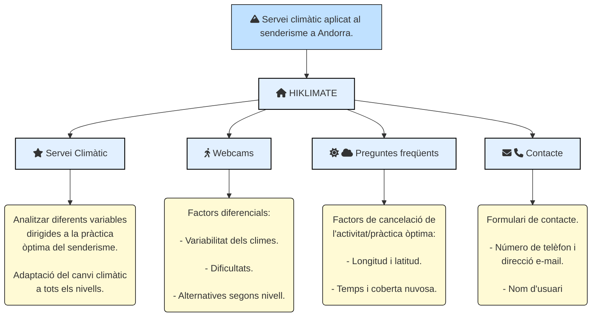

# HIKLIMATE

## Tema i motivació
He escollit realitzar la pàgina web sobre el projecte que vam iniciar durant el transcurs de l'assignatura projecte V amb 
el meu company **Lluís Salvat**, referent a la creació d'un servei climàtic per a la pràctica del senderisme a Andorra a partir de 
la definició d'unes variables i la automatització i càlcul del índex d'aquestes variables, tal com veiem a continuació:

**Variables:**

[Dades](data/base_dades.png)

[Operacionalització de les variables](data/operac_variables.png)

Si ens centrem en el que m'ha motivat per la realització d'aquesta pàgina web, hi han diversos motius. En primer lloc, 
perquè coma a amant de la geografia, el senderisme es realitza en geografies 
diferents de les que ens són habituals com pugui ser qualsevol localització enmig d’una ciutat, on el principal factor que es té en compte
per la seva pràctica és la sensació de llibertat i el clima, sobretot si entre l'inici i el final d'un itinerari hi ha molts quilòmetres de distància.
Cal adonar-se que, fins i tot, al llarg d'un dia en un mateix punt, les condicions meteorològiques poden canviar significativament; 
sobretot si es programa una activitat que suposi un gran desnivell en algun dels sistemes muntanyosos d’Andorra. Així doncs, trobo molt important 
conèixer la previsió del temps i en especial, les alertes meteorològiques de les diferents rutes, ja que si la informació anuncia unes condicions 
adverses, s’han de planificar altres destinacions o activitats.

En segon lloc, un fet que m'ha motivat a fer aquest pàgina web, fa referència a que no disposem d’un sistema climàtic de qualitat que se centri en 
aquesta activitat al territori, ja que em vaig adonar que Andorra disposa de poca informació climàtica, i que la tenim és molt limitada segons la 
parròquia on ens trobem, així que em vaig proposar aconseguir diferents dades meteorològiques especifiques pels diferents itineraris.

En definitiva, com que a Andorra tenim un clima molt variat depenent del territori on ens trobem, la creació d'una pàgina web que
pugui arribar a donar servei a diferents usuaris que vulguin pràcticar aquesta activitat em sembla molt interessant i necessària.

## Continguts
El meu repositori està fragmentat en diferents arxius i carpetes que permetran observar la dinàmica que tinc pensat seguir a l'hora d'elaborar la pàgina web,
com la carpeta *data*, on explico en detall gran part dels continguts que m'agradaria que apareixissin en la pàgina web. Encara així, la meva pàgina web disposarà d'aquests punts a la capçalera:

**Servei Climàtic**: en aquesta primera secció, introduiriem un breu anàlisi de diferents variables gràcies a l'oportunitat i constant informació climàtica i de predicció que ens pot oferir un servei climàtic de qualitat i la potencialitat que té en un sector turístic com és el senderisme en un país petit com Andorra.

**Webcams**: en aquest segon apartat, exposarem algunes de les webcams referents a punts claus del territori a través de les condicions meteorològiques de les rodalies de la Borda Vidal, Envalira i Roc de Sant Pere. Rutes claus per a dur a terme l’activitat de senderisme en diferents itineraris del territori de manera òptima i adaptada als usuaris finals als quals ens dirigim (*anomenats al word de la carpeta data*)

**Preguntes freqüents**: en aquest punt, analitzarem la variabilitat climàtica depenent del punt del territori on ens trobem a partir del tractament de diferents variables com:(longitud, latitud, temps i LCC (Baixa Coberta Nuvosa)) extretes del Centre Europeu de Previsions Meteorològiques a Mitjà Termini.

**Contacte**: finalment, en aquest darrer punt deixarem l'opció d'omplir un formulari de contacte, compòs per un nom i e-mail, i si es vol un missatge.

Pel que fa als continguts de les carpetes d'aquest repositori que comentavem anteriorment, tinc una carpeta amb les diferents imatges a utilitzar, una altra de mapes, on hi ha el mapa realitzat amb QGis2web i els fitxers generats, una altra amb la LICENSE que ens va recomanar el professor seguir i un arxiu igual txt. on es fa una sinopsis de 9 punts de la LICENSE GPL3 utilitzada, un arxiu .gitignore on hi han els arxius que no vull que el lector tingui en compte i finalment un index.html on hi ha el codi de la meva pàgina web i altres arxius html que he utilitzat per enllaçar correctament les diferents pàgines del meu index.html.
Dins d'aquest mateix punt, també considero molt important destacar les referències bibliogràfiques que he seguit a l'hora d'obtenir els continguts, tant descriptius com cartogràfics.

**Bibliografia**

Servei Meteorològic Nacional (2021). Estacions meteorològiques. 
https://www.meteo.ad/estacions

Servei Meteorològic Nacional (2021). Climatologia. 
https://www.meteo.ad/climatologia

European Centre for Medium-Range Weather Forecasts. (2017). ECMWF. Free Public 
Datasets
https://www.ecmwf.int/en/forecasts/datasets

Institut d’Estudis Andorrans. (2021). Visor de mapes (IDE)
https://www.ideandorra.ad/geoportal/

https://www.qgistutorials.com/es/docs/web_mapping_with_qgis2web.html

https://getbootstrap.com/docs/5.0/examples/

## Estructura de la web
Aquest punt l'he realitzat a partir de **Mermaid**, una eina de diagrames i gràfics basada en Javascript que representa definicions de text per crear i modificar diagrames de manera dinàmica. 

## Cartografia
Per tal de realitzar aquest punt, mostraré el mapa realitzat amb QGIS2web que vaig realitzar.
[Mapa](Images/mapa1.png)

Aquest mapa també es pot observar en la pàgina web a través de la pestanya **Servei Climàtic** del meu repositori abaix de tot. Dit això, també m'agradaria destacar que aquesta cartografia ha estat modificada segons les indicacions del professor durant la presentació

## Dificultats i millores
En primer lloc, a nivell de contingut he de reconeixer que no he tingut gairebé cap dificultat, ja que tenia molta informació descriptiva treballada en l'assignatura de Projecte V, així que unicament he hagut d'elegir aquella més relevant i de més interès per una pàgina web i per un usuari.

D'altra banda, considero que he millorat molt la meva metodologia de treball, en saber els principis bàsics d’HTML, CSS i Java Script i sobretot pel fet d’haver practicat molt a classe. Pel que fa a la cartografia corresponent, es veritat que en un inici em va donar molts problemes, però els he pogut solucionar, ja que les icones em sortien tapades amb un quadre negre com si l’eina QGis2Web no les llegís. Aleshores, el que vaig fer va ser borrar la que tenia i anar provant quines llegia el programa fins que vaig trobar una icona apropiada i que es podia llegir en realitzar el procés corresponent. 
Pel que fa al CSS, si be es veritat que he entès els conceptes considero que hauríem d’estar molt més temps per poder desenvolupar un CSS de manera autòctona per la nostra pàgina web, fet aplicable a l’hora d’executar JavaScript, el qual ha sigut molta proba error malgrat tenir una plantilla i aquest ja definit, en voler modificar algunes parts. Aquest últim fet però, m’ha proporcionat molta fluïdesa a l’hora de trobar i solucionar problemes que he tingut.
En termes generals, considero que es una pàgina bona, i que compleix tots els requisits que ens vau demanar per a un correcte desenvolupament d’aquesta, en tenir CSS i JavaScript en dos fitxers diferenciats amb el seu corresponent codi i enllaçat al meu index.html i en ser responsiva i útil.

Pel que fa a millores o aspectes postius considero que vaig encertar a l'hora d'utilitzar l'editor de còdi de Visual Studio, ja que hi estava força familiaritzat i un cop vaig aprendre com fer *commits*, *pulls*, i *push*, es molt intuitiu i em permet treballar amb molta comoditat, tal com s'observa a continuació:

[captura1](Images/vs1.png)

[captura2](Images/vs2.png)

